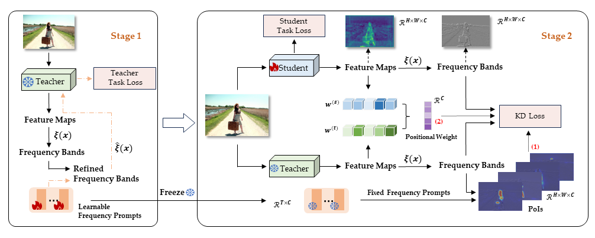
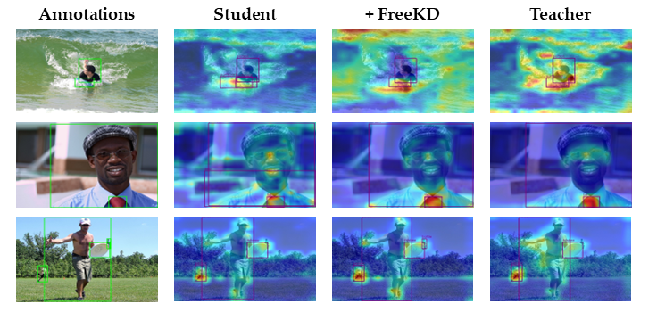

# FreeKD: Knowledge Distillation via Semantic Frequency Prompt

:fire: Official implementation of paper "FreeKD: Knowledge Distillation via Semantic Frequency Prompt", CVPR 2024.

By Yuan Zhang, Tao Huang, Jiaming Liu, Tao Jiang, Kuan Cheng, Shanghang Zhang

<p align='center'>

</p>

## Installation  

### Install MMRazor 0.x

```shell
git clone -b 0.x https://github.com/open-mmlab/mmrazor.git
cd mmrazor
```

```shell
pip install -v -e .
```
### Install Wavelets
```shell
git clone https://github.com/fbcotter/pytorch_wavelets
cd pytorch_wavelets
```
```shell
pip install .
```
### Prepare Data Set

Download on [https://opendatalab.com](https://opendatalab.com)

> [!Note]
> If you want to distill on detection and segmentation, you should install mmdetection and mmsegmentation, respectively.

## Reproducing our results

### Train students with FreeKD

This repo uses [MMRazor](https://github.com/open-mmlab/mmrazor) as the knowledge distillation toolkit. For environment setup, please see [docs/en/get_started.md](docs/en/get_started.md).

**Train student:**  

```shell
cd mmrazor
sh tools/mmdet/dist_train.sh ${CONFIG} 8 ${WORK_DIR}
```

Example for reproducing our `freekd_retinanet_r101-retinanet_r50_coco` result:

```shell
bash tools/mmdet/dist_train.sh configs/distill/freekd/freekd_retinanet_r101-retinanet_r50_coco.py 8 --work-dir work_dirs/freekd_retinanet_r101-retinanet_r50
```


### Results  

* Baseline settings:  

  |        Student         |         Teacher         | FreeKD |
  | :--------------------: | :---------------------: | :------: |
  | Faster RCNN-R50 (38.4) | Faster RCNN-R101 (39.8) |   40.8   |
  |  RetinaNet-R50 (37.4)  |  RetinaNet-R101 (38.9)  |   39.9   |
  |    FCOS-R50 (38.5)     |    FCOS-R101 (40.8)     |   42.9   |

* Stronger teachers:

  |        Student         |            Teacher            | FreeKD |
  | :--------------------: | :---------------------------: | :------: |
  | Faster RCNN-R50 (38.4) | Cascade Mask RCNN-X101 (45.6) |   42.4   |
  |  RetinaNet-R50 (37.4)  |     RetinaNet-X101 (41.0)     |   41.0   |
  |  RepPoints-R50 (38.6)  |     RepPoints-R101 (44.2)     |   42.4   |

### Visualization

<p align='center'>

</p>

## License  

This project is released under the [Apache 2.0 license](LICENSE).

## Citation  
If you use FreeKD in your research, please cite our work by using the following BibTeX entry:
```
@article{zhang2023freekd,
  title={FreeKD: Knowledge Distillation via Semantic Frequency Prompt},
  author={Zhang, Yuan and Huang, Tao and Liu, Jiaming and Jiang, Tao and Cheng, Kuan and Zhang, Shanghang},
  journal={arXiv preprint arXiv:2311.12079},
  year={2023}
}
```
